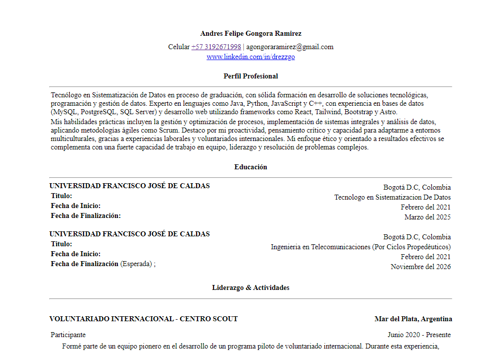

# roadmap.sh - Frontend

This repository contains solutions to all the frontend challenges and projects from the roadmap.sh website. Each solution is published and can be accessed through the provided URLs.

## Project URL

[Single Page CV](https://roadmap.sh/projects/single-page-cv)

## Project Previews

  
  <!--  -->

